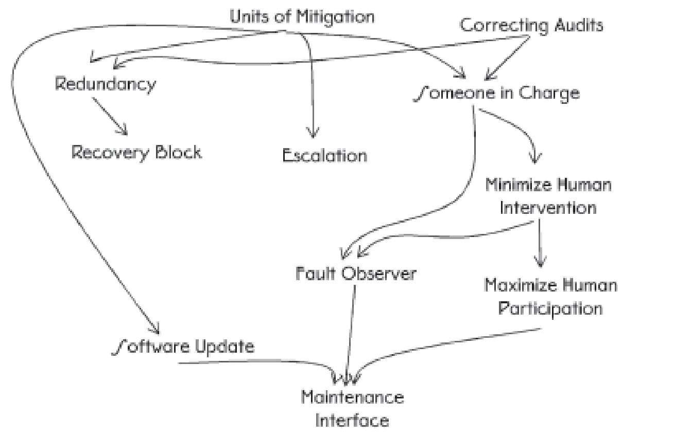

# Chapter 4: Architectural Patterns

We continue describing the patterns mentioned in chapter 4 of the book Fault Tolerance.

	</img>

## Someone in charge

### Intro

Anything can go wrong, even during error processing. When this happens the system might stop doing the error processing in addition to not doing the normal processing.

### Problem

Detection is hard; recovery is also hard. Within the world of fault tolerance, there are two kinds of detection:

1. Detecting the actual error
2. Detecting the part of the system that has failed silently

If that part of the system knows what should be happening, then the system is robust and it can fix the problem by itself or report it to the _FAULT OBSERVER_

If something does not work there must be part of the system that can restart processing actions to resolve the situation.

### Forces

##### Redundancy

If the system has multiple active elements, as can happen when they share the workload, develop some heuristic that will identify which is in charge during error processing.

##### Single component in charge of error processing

A problem with having a single component in charge of fault tolerance activities is that it provides a single point of failure. For any individual fault tolerance related action there must be a clearly identified or identifiable responsible entity. The responsibility can also be distributed across the system.

The module that performs the management can get complicated if it has to administer many different kinds of activities.

##### Dual Masters

The problem of ‘dual masters’ arises when more than one element claims to be *SOMEONE IN CHARGE*. A similar problem arises in *VOTING*. The system must have an automatic way of resolving this situation. Two simple techniques to resolve the issue are to use a lower address or an earlier processor start time to decide which should be considered to be in charge

### Solution

All fault tolerant related activities have some component of the system (‘someone’) that is clearly in charge and that has the ability to determine correct completion and the responsibility to take action if it does not complete correctly. If a failure occurs, this component will be sure that the new failure doesn’t stop the system.

The component in charge must be able to monitor the progression of actions taken to process the error and if they become stalled it must be able to initiate alternative actions, possibly _ESCALATION_ to 
more drastic measures.

Sometimes the FAULT OBSERVER (10) or the SYSTEM
MONITOR (15) perform dual rolls and serve as the elements
in charge in addition to their other responsibilities

**A Responsibility list**
| Action        | In Charge   |
| ------------- | ----------- |
| Checkpointing | Each task   |
| Rollback      | Component R |
| Roll-Forward  | Component R |
| Load Shedding | Component S |

The general techniques of *SYSTEM MONITOR*, including *HEARTBEATS* and *ACKNOWLEDGEMENTS*, can be used to ensure that the system has not silently failed

### Example

-   The caller of a method or function is in charge of that relationship.
-   A module in a system that is responsible fro the proper initialization and startup.
-   A management node in a cluster of systems

---

## Minimize Human Intervention

### Intro

### Problem

### Forces

### Solution

---

## Maximize Human Participation

### Intro

### Problem

### Forces

### Solution

---

## Maintenance Interface

### Intro
Many highly available devices have maintenance commands to perform configuration, logging or health and status checking actions. These commands are passed additionally to the messages of the application processing as input of the system.

### Problem
If only one interface is provided by the system, the inputs for the application and for the maintenance will be intermixed and separated inside the system.

This is a problem when the system is overloaded or in error processing state, the maintenance inputs can be lost due to Shed Load.

By intermixing maintenance inputs and application inputs the system can be opened up for security breaches. A person with access to the application can attempt to breach the security of the system by submitting a maintenance command instead of an application-related one. 

### Forces
Forces for the Maintenance Pattern are: 
- **Maximum Availability**: The system should as available as possible
- **Load Management**:  The workload related inputs outnumber the maintenance messages in most applications.
- **Timely Decisions**: During system failures or errors, quick decisions are needed and information for maintaining the system should be readily available
- **Security Measures**: The System should be made more secure, so that unauthorized access and malicious attacks are limited
---

### Solution
A solution to the problems is to have a separate maintenance interface that is visible to those personnel and other systems that need access. To hinder unauthorised person to access, security measures should be employed on it. 

The maintenance interface can be shared among maintenance and maintenance-like functions. For example, accessing logging information (even though it is not directly related to maintenance) would be an acceptable use of the maintenance interface (See also Fault Observer as example)

By providing a separate interface exclusively for maintenance interactions, you can ensure that application-level interfaces are free for the application workload, enhancing system performance, and security.

## Fault Observer

### Intro
When you are designing a system that is meant to be fault tolerant, you know errors might happen and you want to be prepared for them. No system exist totally in isolation: it it always has someone (people or computers) that watches of it and are interested in how it is working, especially when it fails. And for exactly this purpose the Fault Observer Pattern should be used.
The Fault Observer Pattern is focused on creating a system that is not only fault-tolerant but also informs all interested parties about the faults and errors that are detected and processed. It lays a base for also implementing FAULT CORRELATION and SOMEONE IN CHARGE patterns. 

### Problem
The challenge is how to keep interested parties informed about faults and errors, especially when the system is designed to handle these automatically without adding to much redundancy and overhead to the code itself. 

### Forces
- The desire to minimize human intervention (detect and process errors automatically) while maximizing human participation (what faults are found and what errors were corrected) when necessary.
- The need for software updates and other fault treatment techniques (Small patches or Software update based on the information of the errors / faults to correct them)
- The system should not stop but continue operating and correct the errors automatically but log all the information available .
- All parts that identify and process errors need to be able to publish it. 
- Publishing information from every part that detect errors is:
	- inefficient
	- adds duplicate code, 
	- is an additional source for faults
	- makes maintenance harder
	- increases the impact of MAXIMIZING HUMAN PARTICIPATION

### Solution
The Fault Observer serves as a centralized entity that collects fault and error reports. It then publishes these reports to all interested subscribers over the MAINTENANCE INTERFACE, be it human operators or other systems. The Fault Observer may also perform other fault tolerance functions, but its primary role is to ensure that all interested parties are well-informed about the system’s condition.

A system can have one or more fault observers. If multiple fault observers are build into a system they should either provide redundancy for each other or be dedicated to different types and collections of faults. 

By separating the Fault Observer, there's no need to build subscription and publication mechanisms into many places, therefore reducing the maintenance burden.

# Questions
