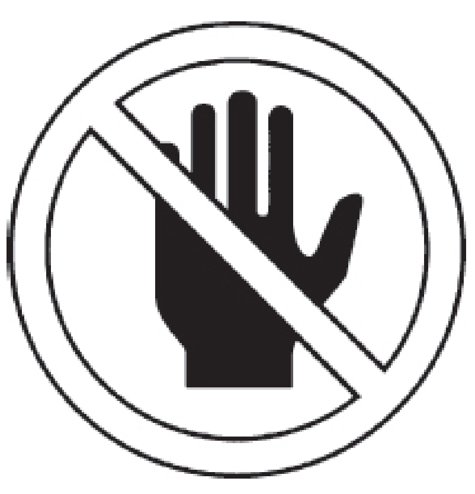
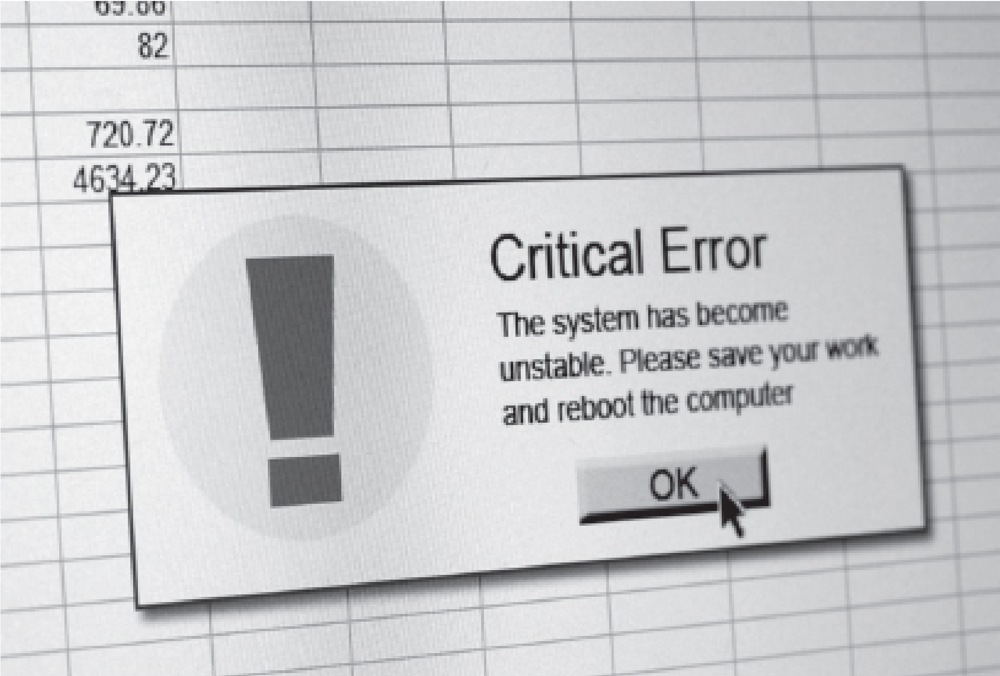
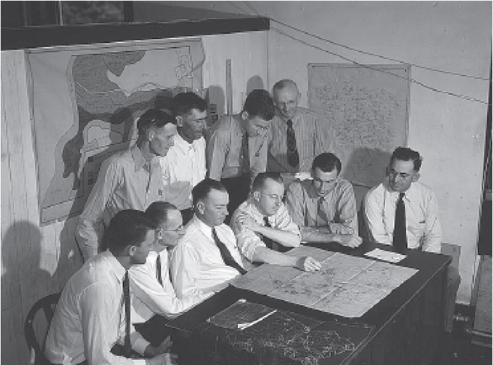

# Chapter 4: Architectural Patterns

We continue describing the patterns mentioned in chapter 4 of the book Fault Tolerance.

</img>

## Someone in charge

### Intro

Anything can go wrong, even during error processing. When this happens the system might stop doing the error processing in addition to not doing the normal processing.

### Problem

Detection is hard; recovery is also hard. Within the world of fault tolerance, there are two kinds of detection:

1. Detecting the actual error
2. Detecting the part of the system that has failed silently

If that part of the system knows what should be happening, then the system is robust and it can fix the problem by itself or report it to the _FAULT OBSERVER_

If something does not work there must be part of the system that can restart processing actions to resolve the situation.

### Forces

##### Redundancy

If the system has multiple active elements, as can happen when they share the workload, develop some heuristic that will identify which is in charge during error processing.

##### Single component in charge of error processing

A problem with having a single component in charge of fault tolerance activities is that it provides a single point of failure. For any individual fault tolerance related action there must be a clearly identified or identifiable responsible entity. The responsibility can also be distributed across the system.

The module that performs the management can get complicated if it has to administer many different kinds of activities.

##### Dual Masters

The problem of ‘dual masters’ arises when more than one element claims to be _SOMEONE IN CHARGE_. A similar problem arises in _VOTING_. The system must have an automatic way of resolving this situation. Two simple techniques to resolve the issue are to use a lower address or an earlier processor start time to decide which should be considered to be in charge

### Solution

All fault tolerant related activities have some component of the system (‘someone’) that is clearly in charge and that has the ability to determine correct completion and the responsibility to take action if it does not complete correctly. If a failure occurs, this component will be sure that the new failure doesn’t stop the system.

The component in charge must be able to monitor the progression of actions taken to process the error and if they become stalled it must be able to initiate alternative actions, possibly _ESCALATION_ to
more drastic measures.

Sometimes the FAULT OBSERVER (10) or the SYSTEM
MONITOR (15) perform dual rolls and serve as the elements
in charge in addition to their other responsibilities

**A Responsibility list**
| Action | In Charge |
| ------------- | ----------- |
| Checkpointing | Each task |
| Rollback | Component R |
| Roll-Forward | Component R |
| Load Shedding | Component S |

The general techniques of _SYSTEM MONITOR_, including _HEARTBEATS_ and _ACKNOWLEDGEMENTS_, can be used to ensure that the system has not silently failed

### Example

-   The caller of a method or function is in charge of that relationship.
-   A module in a system that is responsible fro the proper initialization and startup.
-   A management node in a cluster of systems

---

## Minimize Human Intervention

</img>

### Intro

People are the cause of many failures in long-running systems through the inappropriate actions they sometimes take. The goal of this pattern is to minimize the amount of human intervention required to keep the system running.

##### Three types of Error

There are three categories of errors in highly available systems.

1. Hardware: Errors that occur in computer and related elements. (networks, storage, etc.)
2. Software: Design and implementation errors in the software.
3. Procedural: Errors that are result of mistakes made by the operating personnel.

The system must be designed to minimize the ability for operating personnel to cause procedural errors.

### Problem

How can we prevent people from doing the wrong things and causing errors?

### Forces

##### Humans make mistakes

People do worse than computers in situations where there are long series of steps needed to accomplish a task. People skip steps, either accidentally or on purpose. Computer systems will do them in the same order each time.

##### Humans are slow

Events, normal processing or failures, are happening so quickly that inclusion of the human operator is infeasible. Design the system to detect and process errors automatically.

This will be the fastest way to return to system availability.

Design the system to present status information to the operators as quickly as possible and in a way that they notice. Sounding an _AUDIBLE ALARM_ is one way to get their attention quickly.

##### Use Humans for what they are good at

One of the things that people do better than machines is drawing meaning from sequences of events that seem unrelated.

##### Provide information

The system should give people enough information to help automatic actions. The system must also provide the mechanisms to enable people to intervene when necessary, this is described in _MAXIMIZE HUMAN PARTICIPATION_

The spinning hourglass or a loading screen give the user an indication that the system is performing actual work and has not died.

If the operators are not comfortable that the system is operating, <u>they will do something</u>, and what they do might make the situation worse.

### Solution

Design the system in a way that it is able to process and resolve errors automatically, before they become failures. This speeds error recovery and reduces the risk of procedural errors contributing to system unavailability.
The system should provide the operating personnel with enough information for them to follow the progress of error detection and processing progress, but the operating personnel shouldn’t be required for the resolution of errors.

Avoid the following error reporting:

How do you implement this?

1. Make sure that errors are reported to the _FAULT OBSERVER_ which will ensure that all the appropriate monitoring systems will be notified.
2. Make sure that individual components do not send messages to the outside world
3. Design the strategies and techniques into the system that enable it to detect, process, and ultimately treat the faults, errors, and failures without human assistance.

---

## Maximize Human Participation

### Intro

The system is _MINIMIZING HUMAN INTERVENTION_ to reduce the risk of unavailability due to procedural errors.

People built the system. The designers of the system understand how it works, and how it should work. Experienced operators know how it does operate. The expertise of these people can help to resolve problems quickly.

### Problem

**Should the system ignore people totally? That will reduce procedural errors.**

Procedural errors contribute to system unavailability. The actions of human operators must be moderated by what is in the best interest of the system, the involvement
of people should be limited.

### Forces

##### Enable experts to provide help when needed

The system should provide ways for experts to contribute to the resolution of errors. There are different kinds of experts:

-   some helped build the system
-   some are very skilled at its maintenance and operation

Commands and directives to the system to steer its recovery let the operators eliminate false attempts and focus recovery down productive paths.

##### Use Humans for what they are good at

External observers, people in the present case, tend to have a broader view of the situation that the system will be able to have. They can make up for gaps in the programming that keeps the system from a clear view, and they can know about physical problems, for example that the system backups are a long distance away.

<u>Important</u>: People can also make spur of the moment decisions that might be incorrect.

##### Report the important information first

Display the most important information first, followed by less important information. Use a timestamp or message sequence tag to facilitate a complete understanding of the system state.

Output messages reporting errors are called ‘Action Messages’ because they require some action on the part of the local workforce

##### Enable human involvement only when it makes sense

There is no one always-correct kind of involvement.

In safety-critical systems like avionics, the ability of the operator to override or alter error processing is essential and absolute.

In other systems, such as networking systems that don’t have safety ramifications, human involvement aids error processing but is not essential.

In some systems, such as home appliances, the operator standing in front of the microwave oven will be unable to guide the oven’s error processing at all and should not be enabled to for a different kind of safety reason.

##### Design a "safe mode"

The system can enter a ‘safe mode’ and perform no further automatic actions while waiting for the human participation.

This is the correct thing to do in situations where the risk of incorrect action is very high, for example safety-critical systems.

### Solution

##### Know the user and their ability

Design the system to enable knowledgeable operating personnel to participate in a positive way, toward error detection and error processing.

Provide appropriate _MAINTENANCE INTERFACES_ and _FAULT OBSERVER_ capabilities to give the operators the information that they need to be able to contribute constructively.

##### Inform the users

The _FAULT OBSERVER_ is one way to get information and reports out to the operating personnel so that they can constructively assist in error detection and error processing.

Procedural errors will be reduced if the operating personnel have access to predefined practices and procedures to follow to aid in their recovery. These procedures should be written to guide even the experts to ensure that they do not accidentally skip an important step.

##### Update the system

If the system is designed to allow skilled people to participate in recovery, and that participation repeatedly fails, change the system to prevent future failures.

##### Analyze the actions taken during recovery

After errors have been resolved, a _ROOT CAUSE ANALYSIS_ should be done to determine if the human participation in the recovery aided or hindered recovery.

Improving the automatic detection and processing should also be considered. What actions did the expert operating personnel take that can be made automatic next time?

##### Example

If the system is attempting a _ROLLBACK_ recovery with state restored from a _CHECKPOINT_ but the storage containing the checkpoint data is known to the operator to be faulty, an operator that is aware of the disk problem can cause the system to _RESTART_ rather than _ROLLBACK_ .

---

## Maintenance Interface

### Intro

Many highly available devices have maintenance commands to perform configuration, logging or health and status checking actions. These commands are passed additionally to the messages of the application processing as input of the system.

### Problem

If only one interface is provided by the system, the inputs for the application and for the maintenance will be intermixed and separated inside the system.

This is a problem when the system is overloaded or in error processing state, the maintenance inputs can be lost due to Shed Load.

By intermixing maintenance inputs and application inputs the system can be opened up for security breaches. A person with access to the application can attempt to breach the security of the system by submitting a maintenance command instead of an application-related one.

### Forces

Forces for the Maintenance Interface are:

-   **Maximum Availability**: The system should as available as possible
-   **Load Management**: The workload related inputs outnumber the maintenance messages in most applications.
-   **Timely Decisions**: During system failures or errors, quick decisions are needed and information for maintaining the system should be readily available
-   **Security Measures**: The System should be made more secure, so that unauthorized access and malicious attacks are limited

---

### Solution

A solution to the problems is to have a separate maintenance interface that is visible to those personnel and other systems that need access. To hinder unauthorised person to access, security measures should be employed on it.

The maintenance interface can be shared among maintenance and maintenance-like functions. For example, accessing logging information (even though it is not directly related to maintenance) would be an acceptable use of the maintenance interface (See also Fault Observer as example)

By providing a separate interface exclusively for maintenance interactions, you can ensure that application-level interfaces are free for the application workload, enhancing system performance, and security.

## Fault Observer

### Intro

When you are designing a system that is meant to be fault tolerant, you know errors might happen and you want to be prepared for them. No system exist totally in isolation: it it always has someone (people or computers) that watches of it and are interested in how it is working, especially when it fails. And for exactly this purpose the Fault Observer Pattern should be used.
The Fault Observer Pattern is focused on creating a system that is not only fault-tolerant but also informs all interested parties about the faults and errors that are detected and processed. It lays a base for also implementing FAULT CORRELATION and SOMEONE IN CHARGE patterns.

### Problem

The challenge is how to keep interested parties informed about faults and errors, especially when the system is designed to handle these automatically without adding to much redundancy and overhead to the code itself.

### Forces

-   The desire to minimize human intervention (detect and process errors automatically) while maximizing human participation (what faults are found and what errors were corrected) when necessary.
-   The need for software updates and other fault treatment techniques (Small patches or Software update based on the information of the errors / faults to correct them)
-   The system should not stop but continue operating and correct the errors automatically but log all the information available .
-   All parts that identify and process errors need to be able to publish it.
-   Publishing information from every part that detect errors is:
    -   inefficient
    -   adds duplicate code,
    -   is an additional source for faults
    -   makes maintenance harder
    -   increases the impact of MAXIMIZING HUMAN PARTICIPATION

### Solution

The Fault Observer serves as a centralized entity that collects fault and error reports. It then publishes these reports to all interested subscribers over the MAINTENANCE INTERFACE, be it human operators or other systems. The Fault Observer may also perform other fault tolerance functions, but its primary role is to ensure that all interested parties are well-informed about the system’s condition.

A system can have one or more fault observers. If multiple fault observers are build into a system they should either provide redundancy for each other or be dedicated to different types and collections of faults.

By separating the Fault Observer, there's no need to build subscription and publication mechanisms into many places, therefore reducing the maintenance burden.

# Questions
