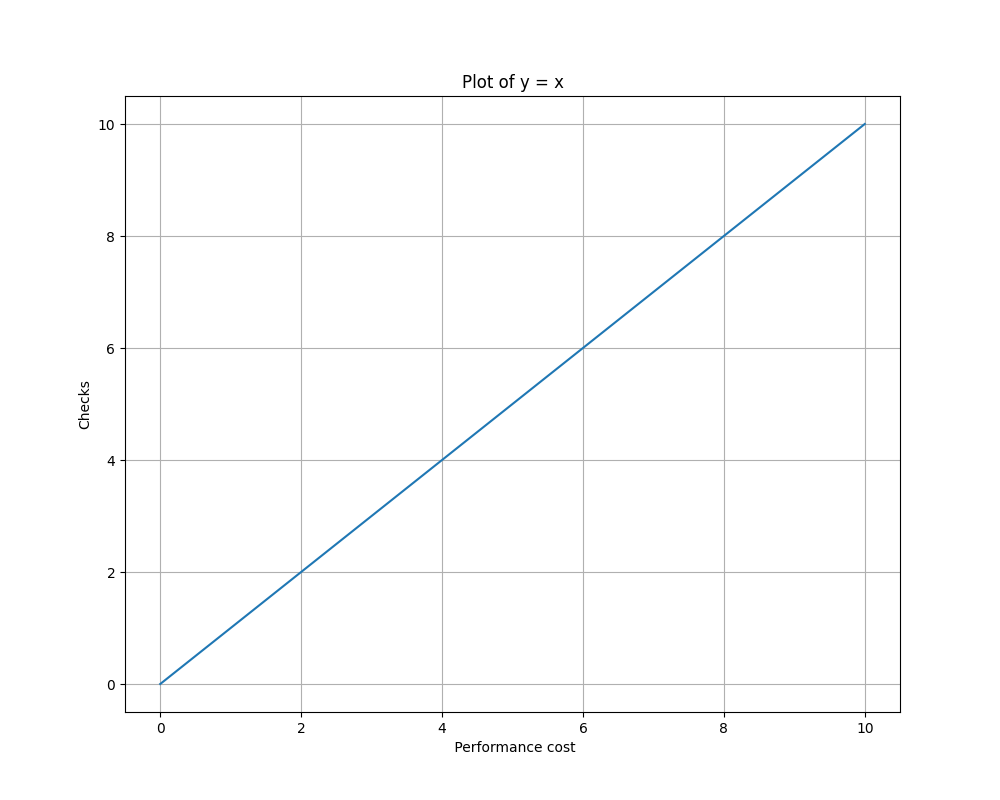

###### Anton Paris & Fadil Smajilbasic

# Chapter 5

The **first step of fault tolerance is detection**. Errors and their underlying faults need to be **detected before** any **recovery or mitigating actions** can be taken to make the system fault tolerant.

This Chapter introduces different patterns that help **detect the presence of errors** or **failures**, as well as help **finding the faults** that caused them.

- **A priori detection**: Uses **constraints that are known in advance** about the system -\> if range of results is unknown, can not be used.
- **Comparing Redundant results**: Enough information present (**Values or Context**)
- **Learn about correct system behavior**: Record of errors and faults detected and apply **Bayesian learning techniques** to learn to **automatically** detect errors and failures

The system needs to be able to **detect both errors and failures**. It also needs to find the **location of the faults** and detect whether **elements of execution have stopped working**. If redundancy is used, a pattern to find out **which result is the correct one** is needed (voting).

The system must also be able to **hinder the error from spreading** throughout the system (containment)

Two mechanism for detecting errors are in common use and **supplement the patterns** in this chapter:

- Test function return codes to determine if an **error condition was returned**
- Use **exception or try/catch** capabilities built into many languages.

## Fault Correlation

### Problem

In order to be more fault tolerant the system needs to be **designed to fail silently** when it fails. In order to process an error or failure the system must **identify the error and what fault caused the error**. Errors can be caused by any of **several faults**. Fault tolerance is about **handling the unanticipated** and **undetectable errors** that occur **during execution**.

While **designing and testing** the system different **common errors** will have been **uncovered, isolated, and corrected**. These already give us **information** of what kind of errors are **likely to occur** during normal execution.

### Forces

- The system **must handle unanticipated and undetectable errors** that occur during execution
- Determining the **specific nature of an error** is crucial for effective error processing
- **Knowledge about common error types or their signatures** helps in anticipating and **preparing** for likely errors during normal execution
- **Errors my occur in a cluster or be related**, requiring a method to **identify** and address the **root cause** effectively.

### Solution


1. **Error Identification, Grouping, and Analysis:** Determine the **nature of the error**, its impact, and the specific fault causing it. This includes understanding the **error's signature and the context** in which it occurred. Look at the unique signature of the error to **sort it into fault category**.
2. **Targeted Recovery Actions:** Implement recovery actions that are **specific to the identified fault** (category), **avoiding overly broad** recovery measures that could **unnecessarily impact** the system. 
3. **Learning from Errors:** Use techniques like **Bayesian learning** to improve error detection and processing based on **past occurrences and successes**. 
4. **Error Containment:** Once an error is characterized, establish an ERROR CONTAINMENT BARRIER to **prevent it from spreading**. 
5. **Utilizing Patterns and Techniques:** Apply various techniques for error processing, such as MARKED DATA for data errors, ROLLBACK, and RESTART for execution sequence alterations. 
6. **Human Participation and Maintenance:** **Share error correlations and data** via FAULT OBSERVER to **enable human intervention** for preventive actions or ROUTINE MAINTENANCE.

## Error Containment Barrier


### Problem

The Error containment barrier pattern addresses the need for a system to **perform optimally in the presence of faults**. When an error is not handled correctly or is not visible to an observer, the **error can propagate**, potentially **causing failures elsewhere**. Without interventions, errors may persist indefinitely, leading to a possible system termination - failure.

### Forces

- The **effects of an error** cannot always be **predicted in advance** and some potential errors can not be **predicted at all**.
- Fault tolerance means that a system must **find a way to ignore or mask the faults** in order to **tolerate** them. Faults are a part of every system!
- **Mitigating errors is not always possible** and depends on the nature of the error and the fault.
- The system needs to be able to detect errors, otherwise it can not be recovered or mitigated.

### Solution

- The system **should isolate the error to a UNIT OF MITIGATION**. Stop the flow of errors from one part to another with a **barrier impervious to errors**, QUARANTINE, and **initiate either error recovery or error mitigation**.
- Error containment barrier pattern **builds on** error detection
- If an error is found, it should be **isolated and contained** by techniques that are in chapter 6 and 7, they will go more into detail how actually recover from an error or mitigate the effects of the error

---

# Complete Parameter Checking

## Intro

You want to detect errors before they cause a problem. Faults and errors result in the system being unavailable

Not only must the system be available, it must also be correct.

It takes time to detect an error. The further from the point of error, when a fault activates, that detection occurs, the larger window in which it could fail, or could propagate to other parts of the system.

## Problem

How can the time from fault activation to error detection be minimized?

## Forces

### Check for errors at each step

The fastest option is to check for error at every operation that the system conducts.

An example is an active-active (_REDUNDANT_) pair of processors that are operating in lock-step and comparing results on every basic operation, and reporting an error when there is a mismatch.

This tight coupling and rapid detection **works best for hardware failures**, and not as well for software failures because the two processors are executing the same program and will both compute an erroneous result from the same incorrect input.

### Only check at the end

Some systems like the Space Shuttle computers, compute results simultaneously but only compare their end results, frequently by _VOTING_.

This relaxation of timing allows different, _REDUNDANT_ software implementations to be used to compute the results.
Detection is still fast, but it is slower than lock step.

### Parameter checking without redundancy

There can be many things that can be checked even without redundant results to compare. You know at design time the acceptable ranges of values for function/method arguments and also for basic computations. The system can use these attributes to detect errors.

##### Example

Consider:

<div style="width:100%;text-align:center">

$A = B/C$

</div>

-   Partial input validation would check that B and C are within the general ranges that are appropriate for the operation.
-   That A is a valid receiver of the information is also checked.
-   Strict typing, either by coding standard or by language support, can help to make sure that operations are on appropriate types of data.

Parameter characteristics that can be checked:

-   index bounds
-   index existence
-   value/range
-   type

**Any checking that is done results in increased reliability.**
Things that can be checked are:

-   function/method arguments
-   function/method return values
-   intermediate results
-   computation results

### Checking takes time

The time between fault activation and their detection decreases with the frequency of checks.

The trade off is that it reduces performance, since all the extra checks take time.



### Centralize checking

The checks can be put inline with the actual processing that uses the data being checked, but that can lead to confusion.

In many cases the checks can be reused.
Putting the checks in a separate place, possibly a library, can make maintenance easier.

Basic operations of the system, can be checked to ensure that it was performed correctly.

### Considerations for a check to take place

-   What is the probability of error within the entity that is checked?
-   How critical are any errors that occur within that entity?

If errors are likely or errors are critical **perform a check**.

### Approximate checks

Some computations that a system performs are very expensive. When a less costly approximation is available, it can be used to check that the result of the expensive computation is reasonable.

### Programming by contract

Programming by contract is a variation of the checking everything proposed by this pattern.

A method or function has a ‘contract’ that specifies its interface and the obligations and benefits:

-   The **obligations** specify the preconditions that the **caller** must guarantee when making the call.
-   This **benefits** the **called** function or method by ensuring that it receives correct, or at least not erroneous, inputs

These contracts are implemented by using checks before and after the processing to ensure that both the input and the output of the method/function meet the contracted specification.

## Solution

Perform frequent checks on data and operations to detect errors quickly and prevent errors from propagating to the rest of the system.

### When errors are detected

Error processing should be initiated. The error should be reported to the _FAULT OBSERVER_.

When **data** errors are detected the error should be reported to _CORRECTING AUDITS_ which will perform _FAULT CORRELATION_ to find, check, and correct related data.

### Error Masking

For all the results generated by the system an ‘acceptability envelope’ is constructed.
The envelope is a range of values that are acceptable for the result.

Example in python:

```python
def check_envelope(result, minValue, maxValue):
	if result < minValue :
		reportError(...)
		return minValue
	elif result > maxValue :
		reportError(...)
		return maxValue
	else :
		return result
```

---

# Existing Metrics

## Intro

The problem appears to be that more resources are needed than are available to process the workload. Depending on the system design the appearance of an overload can take different forms.

## Problem

How should we judge the severity of too many resource requests?
Is there any way that the system might measure how the severity of an overload without contributing to the overload?

## Forces

### Overload indicators

Indicators can be created to measure the severity of the overload.
Adding them to the system can give extremely accurate measures of the resource requests and of the availability of resources. But computing the indicators introduces additional overhead into the system.

You want to let the system process the arriving workload as best as it can. The system shouldn’t waste time on work that is unnecessary.

_HEARTBEAT_ and _ACKNOWLEDGEMENT_ messages are regular messages that can be expected in a system. The amount of time that they take to travel across the system can serve as an indicator of messaging path congestion.

When the time becomes excessive, <u>overload controlling error mitigation is initiated</u>

##### System indicators

Using system indicators does not increase overhead, but they are often vague.

One example is the % of CPU busy time, but it doesn't directly report the time per request; it instead offers only an indication of the total system workload.

## Solution

Use pre-existing indicators already tied to the resource as an indicator of the system’s overload condition

The system will have data to allow it to assess the severity of an overload and to perform _FAULT CORRELATION_ on the system.

It is important to periodically _REASSESS THE OVERLOAD DECISION_ by checking the overload indicators

---

# Voting

## Intro

_REDUNDANCY_ exists in the system that provides multiple answers.

Redundancy could be:

-   Multiple hardware units working on the same problem and computing the answers separately.
-   Having multiple copies of a software element, all computing the same result in parallel.

The initial reason to have _REDUNDANCY_ is because you are afraid that an element might have latent faults that prevent it from behaving error-free.

## Problem

The system has multiple answers. How does it know what answer should be used?

Table from Chapter 1:

_Overview of how many redundant units are required to tolerate independent faults_

| Minimum number of components | Type of Failure      |
| ---------------------------- | -------------------- |
| n + 1                        | Fail silent failures |
| 2n + 1                       | Consistent failures  |
| 3n + 1                       | Malicious failures   |

Deciding which of the responses is correct is a difficult problem.

## Forces

### Granularity of the voting

Deciding a granularity level of redundant results to choose the answer is generally decided during the architectural design phase based upon the _UNITS OF MITIGATION_.

| Smaller granularity | Higher granularity            |
| ------------------- | ----------------------------- |
| simpler results     | multiple correct results      |
| small computations  | requires complex calculations |
| less choices        | more choices                  |

If there is variation in the computations of a high granularity voting system, the results are less likely to be identical.

### Use checksums

In some cases the ‘answers’ that need to be compared are quite large. This can pose a problem in network bandwidth, storage space, or timing to receive and compare. In cases like
this a _CHECKSUM_ can be used to reduce the quantity of resources needed to decide.

The Space Shuttle flight controls use checksums on the outputs of the four computers generating their commands to assess validity.

### Inexact voting

In some cases the answers that resulted from the various sources can be expected to be identical, for example integers or characters.

In some cases however the results may deviate in ways that prevent direct comparison (inexact hardware representations, floating point rounding, inadequate algorithm design or implementation).

Solutions:

-   Non-adaptive voting: an allowable discrepancy between the results to be compared is used to arrive at the correct result
-   Adaptive Voting: Predict the results based upon past experience and compare the results to the prediction.
-   Weighted Voting: Assign a weight to each result and use the weighted sum as the final result

##### Non-adaptive voting

Non-adaptive voting can be implemented by comparing the maximums or minimums of the differences between values with a threshold.

If the results to be voted upon are all close to each other then any of the results can be used for continued processing.

If the results diverge wildly, even if only a minority of them diverges, then the comparison will report the diverging value and some form of recovery or recalculation can begin. Choosing to use maximum or minimum is based on the context of the situation and the most likely types of deviations expected to be seen:

```python

def non_adaptive_voting(R1, R2, R3, T):
	difference1 = abs(R1-R2)
	difference2 = abs(R1-R3)
	difference3 = abs(R2-R3)

	difference = max(difference1, difference2, difference3)
	# or min(difference1, difference2, difference3)
	# based on the context and most likely deviations
	if difference <= T:
		return R1 # or R2 or R3
	else:
		reportError(...)
		recalculate(...)

```

##### Weighted Voting

Requires a computation to arrive at the result, which can be quite slow.

<div style="width:100%;text-align:center">

$R = W1*R1 + W2*R2 + W3*R3$

</div>
Where:
<div style="width:100%;text-align:center">

$W1 + W2 + W3 = 1$

</div>

If the computed result ($R$) , is used in further computations the system needs to ensure that the errors present in the results do not accumulate.

##### Beware of inexact voting

There are cases where neither of those equations will ever succeed in finding a result. In order to use these you must know something about the data sensitivity of the algorithms in use, the capabilities and limitations of the computational hardware, and allowable thresholds.

### Majority voting

If there are more than two elements performing the calculation, then a simple strategy is to conduct a majority vote to determine which computation is correct.

<u>Beware of the scenario where there is no majority and the vote is evenly split.</u>

Four units can get into this situation where two can vote on each of the possible answers

Solution:

-   Median Voting:
    -   selects the result that is the median of the computations by iteratively removing from consideration the extreme values
-   Formalized plurality voting:
    -   divides the calculations into partitions based upon their value. An element is chosen at random from the partition that has the largest number of members
-   Weighted average voting

### Multiple correct results

Care must be taken if the voting is between results that are different yet correct. For example if the result is a grouping of data without a specified order then there can be more than one correct solution.

A means of choosing one of the results must be designed.

### If voting is required, there is a problem

Computer programs are generally deterministic, unless there are faults active.

**Any disagreement in the computation is the sign of an error.**

This is based on two assumptions:

-   The redundant elements were given the same inputs
-   The elements were designed to produce the same results given the same inputs

Voting mechanisms muss check whether the results are acceptable or consistent not if the answer is correct.

## Solution

Devise a voting strategy to select from the available solutions. If there is any disagreement with the vote, treat the element that loses the vote as erroneous and begin error processing on it.

With any voting scheme the design must mitigate the effects of malicious failures.

The voting should be administered by _SOMEONE IN CHARGE_ . With any voting method you must also make sure that you can trust the entity taking the vote.

---
## Questions

1. Fault Correlation suggests that **error signatures** learned **during design and testing activities** can provide valuable insights into **likely errors** during normal execution.
2. A system needs to use specific indicators in order to measure the performance?

## Solutions

1. \[YES\]
2. \[NO\] System indicators can be used as well