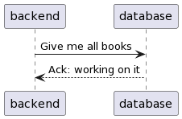

###### Anton Paris & Fadil Smajilbasic

# Chapter 5: Detection Patterns

---

# System Monitor

## Intro
The design of the system is for it to exhibit crash failures, when it silently stops working. The system needs to find out as quickly as possible so that recovery techniques can be applied. FAULT OBSERVER is used to coordinate information Flow. If a system fails silent the error propagation can be reduced but someone needs to get informed about the failure. For this task, there is a System Monitor pattern that lays the base for detection of system failures and communicates with FAULT OBSERVER. 
## Problem
The issues when a system stops working is that it preferrably is fail-silent to reduce the propagation of the error and therefore detection becomes challenging. It is also a challenge to find the error a part of the system malishious fails and detect the failure. 
## Forces
The systems architecture and the criticality of components play a role in determining the monitoring approach and can differ from system to system. 
The system needs a balance between not overusing network and and processing resources, by avoiding agressive error reporting, and the need to detect failures.
## Solution
A System Monitor is implemented to observe system behavior or specific parts to ensure continious operation
The System Monitor reports to the FAULT OBSERVER and initiate corrective action upon detecting a failure. 
A System Monitor can be implemented in different ways
  - Choosing the best suited monitoring method: HEARTBEAT, WATCHDOGS, ACKNOWLEDGMENT 
  - Setting realistic thresholds for error detection
The location of the System Monitor can also differ depending on the system's complexity and reliability requirements:
  - Implement as part of the FAULT OBSERVER
  - A Separate Element (on the same hardware and system) 
  - Using specialized Hardware (different Hardware component for monitoring)
In systems with extreme fault tolerance requirements the FAULT OBSERVER is frequently the entity that takes a global view of the situation and decides on the best processing steps to take. (Role: SOMEONE IN CHARGE) 
## Example

It is better for an ATM to stop taking customer requests than to wrongly dispence money while it is processing an error. (Accuracy) 
If Availability is more important than absolute correctness, options like REDUNDANCY, RESET or HUMAN INTERVERNTION might be used (Availability) 
---

# Acknowledgement

## Intro

Normal operations consist of a request from one task to another. It may or may not have a reply. The target of the request is the system to be monitored. 

This could be either a client-server system or a system that requires peer to peer communication.

In these systems there is a two way message flow between the tasks.

In some cases the system **only** needs to know if a crash failure has occurred when it tries to use the crashed (and monitored) task.

## Problem

When there is a dialog between two task, what’s the easiest way for one task to determine that the other task is alive and functioning?

## Forces

#### Use Heartbeats

You could add extra overhead by adding in separate mechanisms to report a failure, such as _HEARTBEAT_  messages but they add complexity and hence the potential for further faults.

#### Use Watchdog

You could add the hardware or software elements to act as a _WATCHDOG_ but that also adds complexity.

#### Piggybacking

An easy way is to add acknowledging information **to** a reply that is (or will be) sent.

This results in some additional complexity in both parties.

**Disadvantage**: if there are no requests, then there are no replies and hence no acknowledgements that can report a status.

##### Interim Acknowledgement while piggybacking

If the request will take a long time then the requestor might think that the request has died. 

In these cases an interim acknowledgement that merely **acknowledges receipt** of the request can help. A response to the reply will be sent later, when the request completes.

## Solution

1. Send an acknowledgement for all requests
2. All requests should require a reply to acknowledge receipt and to indicate that the system is alive and able to adhere to the protocol

#### What to do when no reply is received

If an acknowledgment reply is not received a failure should be reported to the _FAULT OBSERVER_ and error processing should be initiated.

_A REALISTIC THRESHOLD_ can be set which can lead to better performance and a reduced number of false alarms if an acknowledgment is not received.

#### Problem with this pattern

This pattern does not address the situation where the target task is responding to requests with acknowledgements, but is not sane and is not processing the requests. 

Some other mechanisms such as _CHECKSUMS_, _WATCHDOG_ or _COMPLETE PARAMETER CHECKING_ are needed.

## Example

---

# Heartbeat 

## Intro

## Problem

## Forces

## Solution

## Example

---

# Watchdog

## Intro

## Problem

## Forces

## Solution

## Example

---

# Riding Over Transients

## Intro

## Problem

## Forces

## Solution

## Example

---

# Leaky Bucket Counter

## Intro

## Problem

## Forces

## Solution

## Example

---

## Questions

1. With acknowledgments we can be sure that the system is alive and is  functioning correctly. True or False?
2.

## Answers

  
Answer 1

  **FALSE**: Acknowledgments only tell us that the system is alive and is able to respond. It does not tell us that the system is functioning correctly.

  
Answer 2

  This is the hidden content that will be revealed when you click on the "Click to expand" summary.

