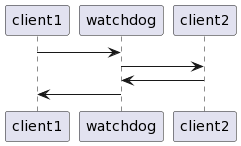

###### Anton Paris & Fadil Smajilbasic

# Chapter 5: Detection Patterns

---

# System Monitor

## Intro
The design of the system is for it to exhibit crash failures, when it silently stops working. The system needs to find out as quickly as possible so that recovery techniques can be applied. FAULT OBSERVER is used to coordinate information Flow. If a system fails silent the error propagation can be reduced but someone needs to get informed about the failure. For this task, there is a System Monitor pattern that lays the base for detection of system failures and communicates with FAULT OBSERVER. 
## Problem
The issues when a system stops working is that it preferrably is fail-silent to reduce the propagation of the error and therefore detection becomes challenging. It is also a challenge to find the error a part of the system malishious fails and detect the failure. 
## Forces
The systems architecture and the criticality of components play a role in determining the monitoring approach and can differ from system to system. 
The system needs a balance between not overusing network and and processing resources, by avoiding agressive error reporting, and the need to detect failures.
## Solution
A System Monitor is implemented to observe system behavior or specific parts to ensure continious operation
The System Monitor reports to the FAULT OBSERVER and initiate corrective action upon detecting a failure. 

A System Monitor can be implemented in different ways
  - Choosing the best suited monitoring method: HEARTBEAT, WATCHDOGS, ACKNOWLEDGMENT 
  - Setting realistic thresholds for error detection
The location of the System Monitor can also differ depending on the system's complexity and reliability requirements:
  - Implement as part of the FAULT OBSERVER
  - A Separate Element (on the same hardware and system) 
  - Using specialised Hardware (different Hardware component for monitoring)
In systems with extreme fault tolerance requirements the FAULT OBSERVER is frequently the entity that takes a global view of the situation and decides on the best processing steps to take. (Role: SOMEONE IN CHARGE) 
## Example

It is better for an ATM to stop taking customer requests than to wrongly dispence money while it is processing an error. (Accuracy) 
If Availability is more important than absolute correctness, options like REDUNDANCY, RESET or HUMAN INTERVERNTION might be used (Availability) 

---

# Acknowledgement

## Intro

Normal operations consist of a request from one task to another. It may or may not have a reply. The target of the request is the system to be monitored. 

This could be either a client-server system or a system that requires peer to peer communication.

In these systems there is a two way message flow between the tasks.

In some cases the system **only** needs to know if a crash failure has occurred when it tries to use the crashed (and monitored) task.

## Problem

When there is a dialog between two task, what’s the easiest way for one task to determine that the other task is alive and functioning?

## Forces

#### Use Heartbeats

You could add extra overhead by adding in separate mechanisms to report a failure, such as _HEARTBEAT_  messages but they add complexity and hence the potential for further faults.

#### Use Watchdog

You could add the hardware or software elements to act as a _WATCHDOG_ but that also adds complexity.

#### Piggybacking

An easy way is to add acknowledging information **to** a reply that is (or will be) sent.

This results in some additional complexity in both parties.

**Disadvantage**: if there are no requests, then there are no replies and hence no acknowledgements that can report a status.

##### Interim Acknowledgement while piggybacking

If the request will take a long time then the requestor might think that the request has died. 

In these cases an interim acknowledgement that merely **acknowledges receipt** of the request can help. A response to the reply will be sent later, when the request completes.

## Solution

1. Send an acknowledgement for all requests
2. All requests should require a reply to acknowledge receipt and to indicate that the system is alive and able to adhere to the protocol

#### What to do when no reply is received

If an acknowledgment reply is not received a failure should be reported to the _FAULT OBSERVER_ and error processing should be initiated.

_A REALISTIC THRESHOLD_ can be set which can lead to better performance and a reduced number of false alarms if an acknowledgment is not received.

#### Problem with this pattern

This pattern does not address the situation where the target task is responding to requests with acknowledgements, but is not sane and is not processing the requests. 

Some other mechanisms such as _CHECKSUMS_, _WATCHDOG_ or _COMPLETE PARAMETER CHECKING_ are needed.

## Example

---

# Heartbeat 

## Intro

## Problem

## Forces

## Solution

## Example

---

# Watchdog

## Intro

You are implementing a _SYSTEM MONITOR_ . You are worried about adding complex software to the system because that can reduce the reliability.

## Problem

How can the system ensure a task is alive with a simple mechanism and you can’t or don’t want to add to messaging or processing overhead

## Forces

### No extra messages

In many circumstances you can’t add in any new messages because of the bandwidth limitation. 
If something is faulty it may not report its state correctly. 
Status reporting capability adds complexity, and hence the chance for additional faults.

### Add checks 

If you can’t add messages to the system, you can add checks on the validity of the tasks operations. 
One way discussed in other patterns is the redundancy based detection of errors by introducing _REDUNDANCY_ or _RECOVERY BLOCKS_  

These techniques are very expensive, in terms of both processing resources and complexity.

### Watch activities that happen routinely

One way of monitoring the system without increasing the complexity is to watch activities that happen routinely.
Example: looking if communications are happening as expected
- Are messages going both ways? 
- Are they frequent enough?

The monitor doesn’t become part of the message stream, it watches from afar.

### Use timers (timeouts)

Another technique that adds only a little to the complexity of the system is to set a hardware time before a critical operation is started.

During and at the end of the operation the timer is checked to determine if the timing was within acceptable limits.

### Add hardware

Sometimes you can add new hardware to the design. A simple hardware component that will watch the monitored task’s execution can be built. 

Possible uses:
- Monitor the control leads of a microcontroller
- Watch a word in memory that the task is known to use, or it could be a passive observer
watching an exchange of messages

Even if new hardware cannot be added the monitor can watch some kinds of things from another process on the same processor or even from another general purpose processor (as contrasted with dedicated watching hardware)

## Solution

Add in the capability for the monitor to observe the monitored task’s activities. 

A Watchdog can be either a hardware or a software component depending on the system requirements, but in either case it will watch visible effects of the monitored task. 

The monitored task will not be modified. 

The Watchdog should take some actions on the monitored task if it doesn't comply with the desired behavior.

One way of implementing this is via peepholes or hardware test points to enable the Watchdog to look inside the tasks.

This pattern is very similar to _SYSTEM MONITOR_. 
A key difference is that a _SYSTEM MONITOR_ **watches a number of tasks**
A _WATCHDOG_ is assigned to monitor **only one**. 

A _WATCHDOG_ will report to a _SYSTEM MONITOR_ and to a _FAULT OBSERVER_ when it detects a failure.
_SYSTEM MONITOR_  describes the kinds of things that a _WATCHDOG_ can do if it detects that the monitored task is not behaving properly.

---

# Riding Over Transients

## Intro
The System operates in an environment with many potential errors and faults, not all of which cause permanent failures. Transient faults and errors are temporaty and resolve on their own and need no error recovery.
## Problem
If every error or fault detected is recovered and handled, the system wasted resources processing transient errors that wont have a long term effect on the system. 
## Forces
The need to quickly detect and process errors must be balanced with the risk of reacting to transient errors that might resolve themselves. Differentiating between transient and non transient errors is crucial, as one needs no attention where as the other must be handled as quickly as possible.
Errors have signatures that can be indentified by FAULT CORRELATION. These signatures help categorize the errors and decide if an error is transient or requires immediate action.
## Solution
- Implement monitoring and fualt correlation to identify errors. Begin error processing immediately for non-transient errors. 
- For potential transient fault, monitor the frequency but delay action unless the occurrences exceeds expected levels.
- Set thresholds for tolerating transient errors based on the system's context and the risk of error propagation

## Example
- In disk operations, transient errors might be ignored under the assumption of disk reliability, riding over the transient.
- For web requests, users often re-request pages quickly, effectively riding over transient network errors.
---

# Leaky Bucket Counter

## Intro

## Problem

## Forces

## Solution

## Example

---

## Questions

1. With acknowledgments we can be sure that the system is alive and is  functioning correctly. True or False?
2.

## Answers

  
Answer 1

  **FALSE**: Acknowledgments only tell us that the system is alive and is able to respond. It does not tell us that the system is functioning correctly.

  
Answer 2

  This is the hidden content that will be revealed when you click on the "Click to expand" summary.

