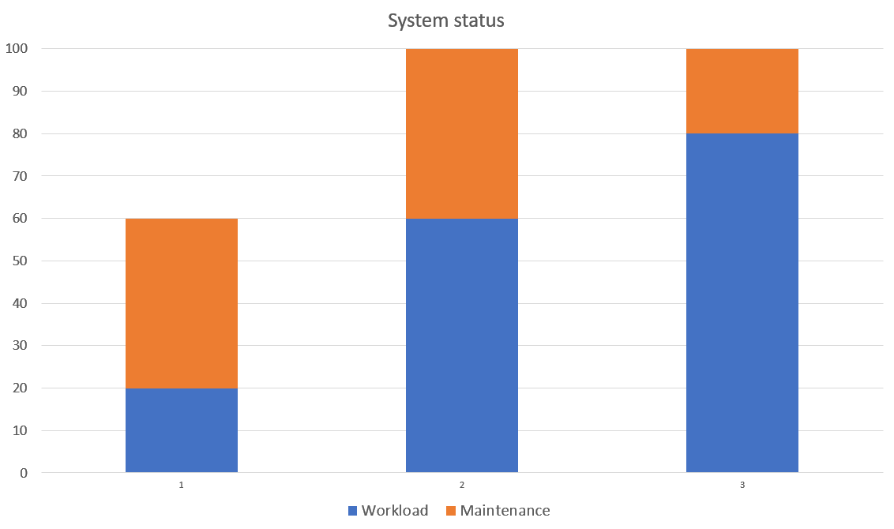

###### Anton Paris & Fadil Smajilbasic

# Chapter 7: Error Mitigation Patterns

The Error Mitigation Patterns discussed in this chapter focus on strategies for mitigating errors in systems without altering the application or system state. The mitigation techniques mask errors and compensate for their effects. 
The Chapter can be broken down into different approaches: 

### Context of Error Mitigation:
Unlike the recovery methods discussed in the previous chapter, which involve changing the system state to continue operations, this chapter focuses on mitigating errors without such state changes. The techniques aim to mask errors and compensate for their effects.

### Types of Errors Addressed:
The chapter deals with two main types of errors: incorrect values or system states, and missed timing requirements or constraints. It presents methods to correct or change faulty values and states, or the underlying faults, allowing processing to continue from the point of error detection.

### Handling Overload and Performance Issues: 
The chapter also covers techniques for handling system overloads and performance issues caused by external factors, like an excess workload. These techniques are designed to help the system survive and return to normal operation without causing additional errors or failures.

### Multiple Faults and Data Errors:
Unlike most fault tolerant systems (as discussed in chapter 1) the mitigation techniques enable multiple faults within a system to exist and be contained, including data faults that can be marked and isolated (MARKED DATA). The chapter emphasizes that performance-related mitigation techniques do not hinder other error detection and processing activities.

### Timing Errors:
It discusses different techniques needed for various types of timing errors, like service request overloads, resource scarcity, or limited processor time.

### Key Premises and Patterns:
Several key premises and patterns are introduced, such as DEFERRABLE WORK, REASSESS OVERLOAD DECISION, EQUITABLE RESOURCE ALLOCATION, and SHED LOAD. These concepts focus on managing system resources efficiently and making dynamic decisions based on the current state of the system.

### Automatic Controls and Load Management:
It describes two categories of automatic actions in response to timing errors: expansive (expanding resources) and protective (protecting the system from overload). It also discusses strategies like SHEDDING LOAD, SLOWING IT DOWN, and FINISH WORK IN PROGRESS for effective workload management.

### Data Error Mitigation:
Chapter 7 touches upon mitigating data errors through marking unreliable data and using error-correcting codes when sufficient redundant information is available.

---

# Overload Toolboxes

## Intro

Overload situations occur when the system loses the resources necessary to handle its workload efficiently. 
This might be due to internal problems, such as memory leaks or from too many requests coming from external sources.

When external systems send too many requests for a service too quickly, the system must handle as many as possible and then degrade as smoothly and as little as possible.

## Problem

How should the system handle situations of overload?

## Forces

#### Components affected by overload:

- **Memory**
  - More memory might be required to store the requests than the system has available.
- **Tangible resources**
  - The requests might require the use of tangible peripheral resources that are already in use.
- **CPU time**
  - Processing the requests might take more time than the system has.

There are a variety of techniques designed to address resource overloads. 

Some techniques work best with only specific types of resources, and don’t help mitigate others.

Some techniques will work for all three. 

**<u>Trying to manage one type of overload with a mechanism designed for another might have devastating results.</u>**

## Solution

Have multiple toolboxes with which to mitigate overloads.

**Use the proper tools for the job**

One toolbox is for managed resources like buffers or ports being controlled by the system.
Another for memory, and yet another for processor CPU time. 

Avoid grouping all of the possible techniques together, as they will only rarely work well for overloads in other categories. 

#### Evaluate overloads

Knowing whether the system is in processor or resource overload requires some way of measuring the overload. The system should use _EXISTING METRICS_ to evaluate overloads.

#### For Tangible Resources

An effective technique to deal with overloads of the tangible variety is to _QUEUE FOR RESOURCES_. 

_EQUITABLE RESOURCE ALLOCATION_ discusses a way to divide up the tangible resources such as memory and peripheral equipment.

#### For CPU

A technique similar to _QUEUING FOR RESOURCES_ that works for CPU cycles which are intangible is to take on _FRESH WORK BEFORE STALE_.

_FRESH WORK BEFORE STALE_: Using LIFO queue to ensure that at least some requests will have a high quality of service.

The capabilities to _SHARE THE LOAD_ with peers or to _SHED LOAD_ also help with CPU time.

#### Overall

In a network of peers, strategies can be designed to enable one peer to notify its neighbors that it is in overload and seek assistance in handling the traffic or in reducing the load from its peers.

Both _FRESH WORK BEFORE STALE_ and _FINISH WORK IN PROGRESS_ consider user/consumer/customer behavior when designing the system’s mechanisms to deal with an excess amount of work.

---

# Deferrable Work

_(work that can be postponed)_

## Intro

You have the following situation:

More new work is arriving than the system can normally handle. The mitigation techniques are working and the system is stable.

The system schedules _ROUTINE AUDITS_ and other _ROUTINE MAINTENANCE_ tasks to keep the system working well.

The system is able to process the workload, although it might be _SHEDDING LOAD_.

The system is doing well despite the extra load. It's not causing errors, and it will go back to normal once the extra work is done.

## Problem

What work should the system shed when the choices are: 
handling most of the new incoming work or the routine maintenance workload?

## Forces

<u>There are not enough resources to handle both the new work and to continue the routine work.</u>

#### Make a choice

The routine work keeps the system fault tolerant.

The choice is to reduce the revenue producing work even more or to restrict some of the maintenance work that prevent errors.

#### Defer the maintenance work

If the system is in overload and is stable, system resources should all be used to process the workload.

It makes sense to defer the work tasks when the system is **not** working properly and then perform maintenance work (such as _ROUTINE MAINTENANCE_ and _ROUTINE AUDITS_).

#### IF it ain't broke, don't fix it

If the system is working at capacity or above and doing it well, do not check if it works: concentrate on the primary aspects of operation.

## Solution

**Make the routine work deferrable.**
If the system is tending toward overload, chances are that the periphery and software are working, otherwise where would all that work be coming from?

There is a chance that the system just seems like it’s in overload, though it may be really reacting to errors.

In that case, _SOMEONE IN CHARGE_ should employ _REASSESS OVERLOAD DECISION_.
_REASSESS OVERLOAD DECISION_ also addresses when this strategy is not providing enough relief and the system is not really stable.

Everything that the system does is important to someone. But not everything is directly related to the primary purpose of the system. 

Tasks should not be deferred forever because that lowers the overall fault tolerance of the system.

# Reassess Overload Decision

## Intro
Addressing a system overloaded with work requests, while utilizing error mitigation techniques.

## Problem
The system is overwhelmed with too many work requests, and its current methods to manage this, like SHED LOAD, are not effectively lessening the amount of work.

## Forces
- The necessity to efficiently manage and mitigate system overload.
- The difficulty in accurately identifying the root cause of errors or overload.
- The potential for system downtime or reduced effectiveness if it cannot process work efficiently.

## Solution
### Feedback Loop Implementation:
Introduce a feedback loop for the system to reassess its FAULT CORRELATION decisions. This loop is crucial for determining whether issues are related to timing or execution errors, enabling the exploration of alternative error processing strategies.
### Escalation Capability:
Design the system with the ability to escalate error analysis. This feature allows the system to test different mitigation techniques or to activate an escalation chain for error recovery. This escalation is essential for addressing situations where initial mitigation strategies are insufficient.

This approach is grounded in control theory, ensuring that the system does not continue down an ineffective path due to a lack of reexamination. The analysis should be conducted by SOMEONE IN CHARGE, who has an overview of the entire system.

---

# Equitable Resource Allocation

## Intro
 Equitable Resource Allocation addresses the challenge of managing and allocating resources in a system with a variety of requests, each having different types and priorities.
## Problem
The system faces a high volume of requests for resources, such as database or network connections. While it tries to prioritize new work over old (FRESH WORK BEFORE STALE), this approach can lead to issues in prioritizing requests correctly, especially when they differ in type or priority.
## Forces
- The need to balance different types of requests (e.g., database queries vs. order placements).
- The challenge of managing requests with varying priority levels (e.g., salesmen vs. ordinary users).
- The risk of resource overload and the inefficiency of processing pools if requests are not allocated properly.
## Solution
Implement a system that pools similar requests and allocates resources based on their availability and priority. This system should:
- Fairly process all requests, either in order or by periodically prioritizing more important requests.
- Avoid priority inversion, where lower priority tasks block higher priority ones by holding needed resources.
- Use QUEUE FOR RESOURCES to group and manage request pools efficiently.
- Include FINAL HANDLING for abnormal request terminations to release held resources effectively.
## Example:
In a scenario where many database queries and a few order placements are received, the system should not just serve the newest requests. Instead, it should group similar requests into pools and allocate resources based on each pool's priority and resource needs. This approach ensures that all types of work are accomplished, even in the presence of concentrated overloads from specific request categories or priorities. 

---

# Queue for Resources

## Intro

Situation: The system is mitigating a workload spike, and is not otherwise in the midst of processing an error. 

Too many requests are being received.

## Problem

What should be done with requests for resources that cannot be handled immediately when they arrive?

## Forces

#### Shed load

An option for the system is to discard all requests that it can’t handle immediately as they arrive.

This supports the pattern _SHED LOAD_ (not handled).

Only those requests that can be handled will be kept. 
This will have immediate effects on an overload.

###### Flaws

- A request that arrived as several individual requests might be prevented from completing.
- Important single work items might be eliminated without any consideration
- The overload might be momentary, and if the request were put in a queue then there may be resources available for it after a very short wait.

#### Queue requests

Managing the queue requires resources and introduces overhead. You must be careful to not make the situation worse by designing inefficient queue handling methods

If the system can store the work in a queue for later processing then the work item might complete eventually.

###### Risks
- The queue might become longer than can be effectively managed
- If after a wait the resources needed for a request are still not available, the request needs to be rejected at that point, or put back in the queue.

## Solution

Store requests for service that cannot be handled immediately in a queue, Figure 68. Give the queue a finite length to improve the likelihood that the request is still important when it reaches the head of the line.

##### Computer generated requests

When the requests are computer generated and must be processed in order, a First In First Out (FIFO) queue should be used (as in _FRESH WORK BEFORE STALE_). 

##### Human generated requests

When the requests are human generated and the order of processing is not important, a Last In First Out (LIFO) queue should be used.

The request that was placed on the queue last will think that they received excellent service.
And the person that placed the longest ago request on the queue probably gave up already.

---

## Questions

1. The Equitable Resource Allocation pattern always prioritizes newer requests over older ones.
2. 

## Answers

  
Answer 1

  **FALSE**: It advocates for a more balanced approach where resources are allocated based on both the availability and priority of different types of requests.

  
Answer 2

  **FALSE**: 

